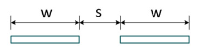
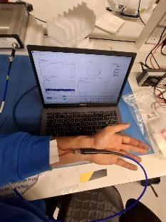
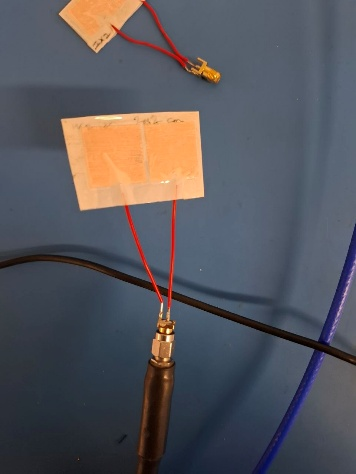
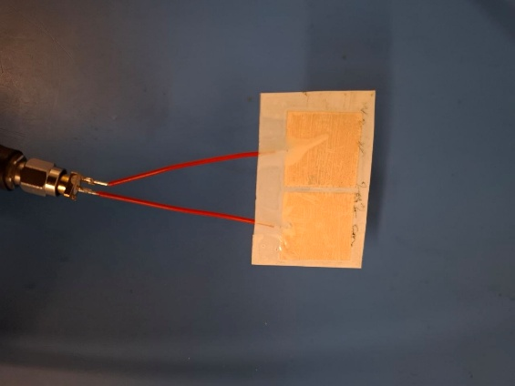
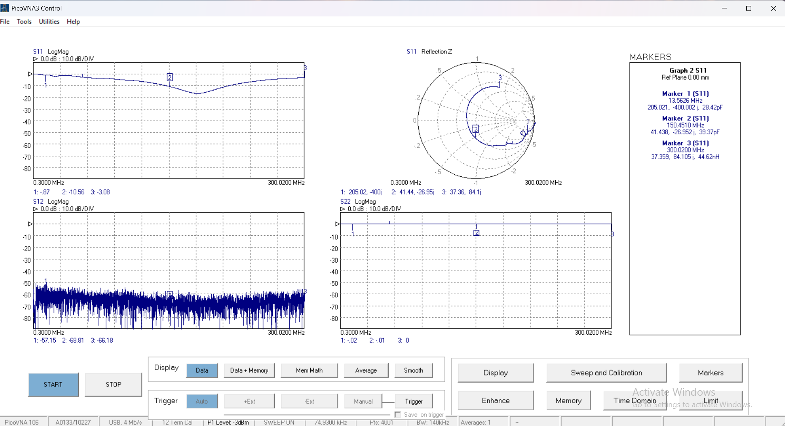
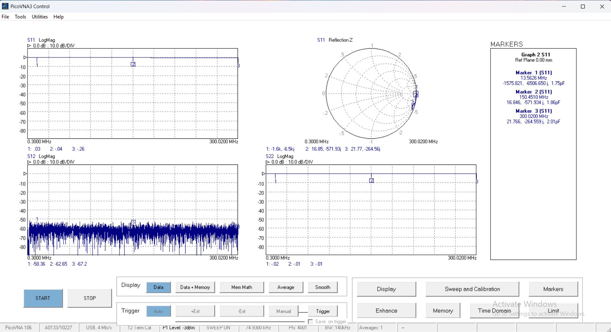
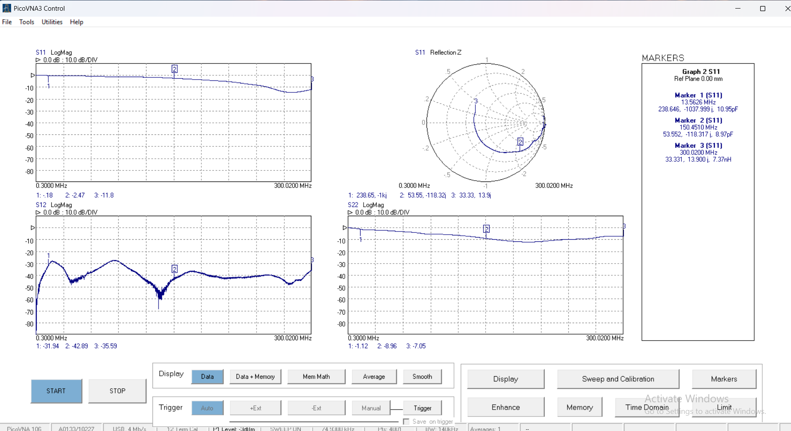
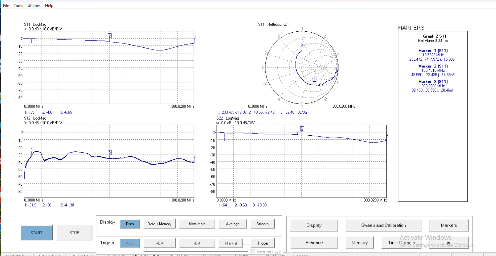
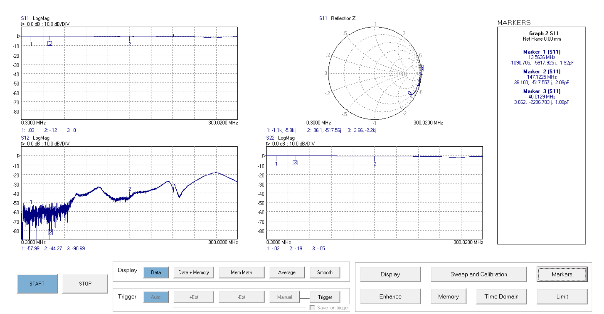

# Capacitive Human Body Communication for Wearable ECG Data Transfer

**Ongoing research project | RF, wearable electronics, VNA measurements and PCB design Under supervision of Dr.Mahmoud Wagih**

This project investigates **capacitive human body communication (HBC)** as an alternative to conventional short-range RF links used in wearable sensors, including NFC and Bluetooth-based links. The main aim is to transfer ECG data from a body-worn sensor to a phone-side receiver by using the **human body itself as part of the communication channel**.

The transmitter uses two coplanar copper plates placed on the skin. The signal is capacitively coupled into the body, and a second electrode pair placed at another body location receives it. In this type of HBC, the body carries the forward signal while the return path is mainly formed by parasitic capacitance between the transmitter/receiver grounds and the surrounding environment. Because of this, electrode size, spacing, skin contact, body position, device ground size and receiver impedance all affect the measured channel.

## Human Body Communication?

The motivation is to reduce the dependence on conventional radiating antennas for short-range wearable communication. Capacitive HBC can offer low-profile electrodes that can be integrated directly into wearable devices or PCBs and a more spatially confined communication path than normal free-space RF links;
The final performance still depends strongly on the electrode geometry, operating frequency, body location, environment and the electrical design of the transmitter and receiver.

## Work completed so far

I first estimated the capacitance of different coplanar copper electrodes and then fabricated several prototypes using copper tape and copper foil. The main prototypes include **20 × 20 mm** and **30 × 30 mm** electrode structures.

  
  
  
  

The prototypes were measured using a **PicoVNA over 0.3–300 MHz**. Two main types of measurements were carried out:

1. **S11 one-port measurements** to study the electrode impedance and capacitance in air and on the skin.
2. **S21 two-port measurements** using two identical electrode pairs at different body locations to study the transmission channel through the body.

For the 20 × 20 mm copper-tape prototype, the measured capacitance was approximately **2 pF in air** and increased to around **30 pF on the skin** before the response moved into the inductive region of the Smith chart.

  
  

The S21 measurements were performed with the electrodes on the same hand, on separate hands, and floating in air. The on-body measurements showed a clear improvement in received signal level, with an increase of almost **30 dB** compared with the low-coupling air case. The strongest initial results were observed in the lower-frequency region around **13.5 MHz**.

  
  
  

These measurements are an initial characterization step. A later stage will repeat the channel measurements using **battery-powered floating transmitter and receiver boards**, which will better represent a real wearable system and reduce the influence of VNA cables and common-ground effects.

## Planned PCB and system design

The next stage is to turn the measurement setup into a complete wearable communication link. I plan to design both the transmitter and receiver PCBs.

The **transmitter board** will include the ECG sensing front end, signal acquisition, digital encoding/modulation, an HBC output driver, selectable impedance-matching components, battery power and the skin electrode interface.

The **receiver board** will use a high-input-impedance front end, filtering and demodulation, followed by a microcontroller and a phone interface such as USB-C. The final operating frequency will be selected from the measured S-parameters while also considering channel loss, interference, electrode size, power consumption and receiver sensitivity.

The PCB design will focus on compact wearable layout, analog/digital separation, low-noise ECG acquisition, controlled high-impedance signal routing, ESD protection, electrode geometry, ground-plane effects and test access for VNA and oscilloscope measurements.

## Status

The project is ongoing. Current work is focused on selecting the best electrode geometry and operating region, then moving from VNA characterization to a custom transmitter/receiver PCB for ECG data transfer through the human body.
